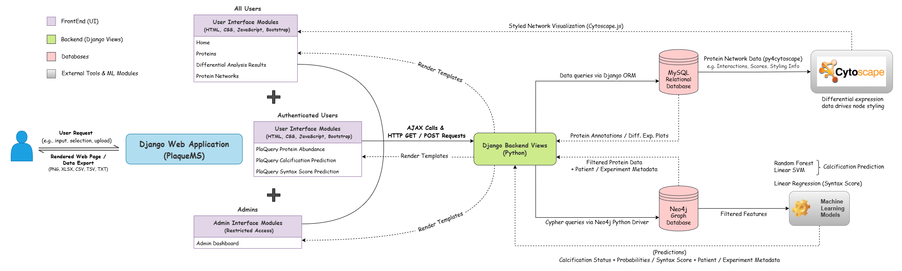

# PlaqueMS

[](https://www.python.org/downloads/release/python-3110/)
[](https://docs.djangoproject.com/en/5.1/)
[](LICENSE)

## *An Integrative Web Platform for Atherosclerosis Omics Analysis.*
Facilitating Visual and Predictive Insights into Atherosclerotic Plaque Biology

## **Project Description**
**PlaqueMS** is an integrative web platform for the exploratory and predictive analysis of human atherosclerotic plaques using multi-omics data, with a primary focus on proteomics. Developed in Django, it provides interactive tools for protein abundance analysis, exploration of differential expression analysis results, protein–protein interaction network visualization (powered by Cytoscape), and predictive modeling of clinically relevant outcomes such as plaque calcification status and SYNTAX score.

The platform integrates a MySQL relational database for structured storage of differential expression results, precomputed visual outputs (e.g. box plots, volcano plots, heatmaps), and protein network-related files. A complementary Neo4j graph database is employed for capturing more complex relationships among patients, clinical metadata, experimental protocols, tissue regions, and protein abundance measurements. This dual-database architecture enables dynamic, phenotype-specific queries across plaque regions and cohorts. Secure user authentication, role-based access control, and an administrative interface support responsible data management and user oversight.

By combining rich exploratory capabilities with machine learning-based prediction, PlaqueMS offers a comprehensive framework for advancing translational cardiovascular research.

<h3 align="center">System Architecture</h3>

<p align="center">
  
</p>

>*High-level overview of the system architecture of PlaqueMS. Solid arrows indicate data flow from the frontend to the backend (user actions, HTTP/AJAX requests, and queries to the database), while dashed arrows represent data or results returned from the backend to the frontend, including rendered web pages, interactive visualizations, and downloadable files. Colored boxes distinguish the platform’s major components: purple denotes frontend user interface modules, green highlights backend logic and Django views, red indicates databases (MySQL and Neo4j), and grey represents external tools and machine learning modules. Certain modules and functionalities are accessible only to authenticated users or administrators. This diagram illustrates the coordinated interactions that enable seamless data analysis and visualization within the platform.*

## 🧑‍💻 Development Environment
Developed and tested locally using:
  - Django (v5.1.7)
  - Windows 10 OS

## 🛠️ Prerequisites
Download and install:
- Python v3.11.9
- Cytoscape Desktop v3.10.3
- clusterMaker2 v2.3.4 (Cytoscape plugin)
- Neo4j Desktop v1.6.1
- Neo4j DBMS v5.24.2
- MySQL Community Server v8.0.40
- (optional) A Python IDE; recommended: Visual Studio Code or Pycharm
- (optional) Git Bash for easier Unix-style command line use on Windows

## ⚙️ Setup Instructions

### 1. Clone the Repository
```bash
git clone https://github.com/NikolaosSamperis/PlaqueMS_project.git
cd PlaqueMS_project
```

<details> <summary><strong>📁 Project Structure</strong> (click to expand)</summary>
    
```
PlaqueMS_project/
├── manage.py    # Django's command-line utility for administrative tasks
├── login/    # Main Django app
│   ├── __init__.py    # Marks directory as python package
│   ├── admin.py    # Admin interface config. for models (not used)
│   ├── apps.py    # App config. settings
│   ├── auth_views.py    # User authentication back-end (login, register, logout)
│   ├── calc_pred_views.py    # "Calcification prediction" tool back-end
│   ├── cyviews.py    # "Protein Networks" tool back-end (Cytoscape-based)
│   ├── forms.py    # Django form classes for user input/validation
│   ├── home_views.py    # Home page back-end
│   ├── insert_views.py    # Script for inserting data in the MySQL database (ignore)
│   ├── management    # Scripts for populating the database (ignore)
│   │   ├── __init__.py
│   │   └── commands
│   │       ├── __init__.py
│   │       ├── insert_uva.py
│   │       └── insert_vienna.py    
│   ├── migrations    # Database migration files for MySQL (ignore)
│   │   ├── 0001_initial.py
│   │   └── __init__.py
│   ├── models.py    # Django ORM models defining MySQL database schema
│   ├── networkTree.py    # Builds and saves a filtered experiment/network tree as JSON (legacy, ignore)
│   ├── pathTree.py    # Builds a hierarchical dataset/experiment tree and saves it as JSON (legacy, ignore)
│   ├── plaquery_views.py    # "Protein Abundance" tool back-end
│   ├── plot_views.py    # "Differential Analysis Results" tool back-end
│   ├── protein_views.py    # "Proteins" tool back-end
│   ├── syntax_score_views.py    # "Syntax score prediction" tool back-end
│   ├── templates    # HTML front-end templates
│   │   ├── Home.html
│   │   ├── calc_pred.html
│   │   ├── login
│   │   │   ├── admin_dashboard.html
│   │   │   ├── login.html
│   │   │   └── register.html
│   │   ├── network.html
│   │   ├── plaquery.html
│   │   ├── plot.html
│   │   ├── plot_result_list.html
│   │   ├── protein.html
│   │   └── syntax_pred.html
│   ├── templatetags    # Custom template tags for use in Django templates
│   │   ├── __init__.py
│   │   ├── auth_extras.py
│   │   └── navigation.py
│   ├── tests.py    # Unit and integration tests for the app (legacy, ignore)
│   └── validators.py    # Custom validation logic for forms.py
├── testdj/    # Django project config. directory
│   ├── __init__.py
│   ├── asgi.py    # ASGI entry point for asynchronous server deployments (legacy)
│   ├── settings.py    # Main Django settings file (config.)
│   ├── urls.py    # URL routing for the project
│   └── wsgi.py    # WSGI entry point for server deployments (legacy)
├── static/    # static files and datasets for the app
│   ├── Dictionary_all.csv    # Protein annotation dictionary for "Protein Abundance" tool
│   ├── HUMAN_9606_idmapping.dat    # Protein ID mapping (used to populate MySQL database, not needed)
│   ├── PlaqueMS    # Main datasets
│   ├── __init__.py
│   ├── calcified_vs_noncalcified_periphery_vp.jpg    # JPG used in the "Home page"
│   ├── heatmap_all.png    # JPG used in the "Home page"
│   ├── heatmap_significant_corrected.png    # JPG used in the "Home page"
│   └── symptomatic_vs_asymptomatic_periphery_vp.jpg    # JPG used in the "Home page"
│
│
├──syntax_ml_utils.py  # Utility functions and scikit-learn-compatible classes for SYNTAX score prediction
│
├──json_tree.json  # Hierarchical JSON tree listing all available experimental comparisons (for "Differential Analysis Results" panel)
│
├──network_tree.json  #  Hierarchical JSON tree listing all available network files for each cohort/proteome extract/plaque region (for "Proten Networks" panel)
│
└── model_artifacts/    # Pre-trained models and related files for predictions
    ├── Cellular_Proteome
    │   ├── 0finalSingleModel.pkl
    │   ├── FeatureMaxNormdata.csv    # ignore
    │   ├── FeatureMinNormdata.csv    # ignore
    │   ├── knn_imputer.pkl
    │   ├── minmax_scaler.pkl
    │   ├── sds_new_input.txt    # ignore
    │   └── selected_features_best_model.csv    # ignore
    ├── Core_Matrisome
    │   ├── 0finalSingleModel.pkl
    │   ├── FeatureMaxNormdata.csv    # ignore
    │   ├── FeatureMinNormdata.csv    # ignore
    │   ├── guhcl_new_input.txt    # ignore
    │   ├── knn_imputer.pkl
    │   ├── minmax_scaler.pkl
    │   └── selected_features_best_model1.csv    # ignore
    ├── GUHCL_syntax_score
    │   └── syntax_pipeline.pkl
    └── Soluble_Matrisome
        ├── 0finalSingleModel.pkl
        ├── FeatureMaxNormdata.csv    # ignore
        ├── FeatureMinNormdata.csv    # ignore
        ├── knn_imputer.pkl
        ├── minmax_scaler.pkl
        ├── nacl_new_input.txt    # ignore
        └── selected_features_best_model.csv    # ignore
```
</details>

>**Note:** The `static` directory is not included in the cloned repository due to its large size. It can be provided by the authors upon request.
>
><br>**⚠️  Required JSON trees**
><br><br>The nested tree panels used in  
>* **Differential Expression Analysis** (`plot.html`) and  
>* **Protein Networks** (`network.html`)
>  
>read their hierarchy from two static files:
>
>| Module | JSON file | Default path |
>|--------|-----------|--------------|
>| Differential Expression | `json_tree.json` | `PlaqueMS_project/json_tree.json` |
>| Protein Networks        | `network_tree.json` | `PlaqueMS_project/network_tree.json` |
>
> Make sure these files are present and kept in sync with the underlying MySQL data before starting the server; otherwise the left‑hand selection panels will appear empty.

### 2. Create and Activate a Virtual Environment
```bash
python -m venv venv311
# On Windows:
venv311\Scripts\activate
```

### 3. Install Dependencies
```bash
pip install -r requirements.txt
```

### 4. Configure Environment Variables
Create a `.env` file in the project root with the following content (adjust as needed):

```
# Django Configurations
SECRET_KEY=your_secret_key

# MySQL Database Configurations
DB_NAME=your_db_name
DB_USER=your_db_user
DB_PASSWORD=your_db_password
DB_HOST=127.0.0.1
DB_PORT=3306

# Neo4j Database Configurations
NEO4J_URI=neo4j://localhost:7687
NEO4J_USERNAME=neo4j
NEO4J_PASSWORD=your_neo4j_password
```
>**Note:** The `SECRET_KEY` for this Django project can be provided after request to the author.


> **After cloning:**  
> Open `testdj/settings.py` and update the `BASE_DIR` variable to match the path where you cloned the project on your machine.


> **Deployment Note:**  
> For public deployments, update the `ALLOWED_HOSTS` in `testdj/settings.py` to your domain or public IP address.

### 5. 🗄️ Setting Up the MySQL Database
1. **Install MySQL**  
   Make sure MySQL is installed and running on your system.

2. **Create the Database**  
   Open your MySQL client (e.g., MySQL Workbench, command line, etc.) and create a new database:
   ```sql
   CREATE DATABASE plaqueMS CHARACTER SET utf8mb4 COLLATE utf8mb4_0900_ai_ci;
   ```

3. **Import the Dumped SQL File**  
   Use the command line to import the provided SQL dump (`dump-plaquems-202507181539.sql`):

>**Note:** The SQL dump File can be provided upon request.

   ```bash
   mysql -u <your_mysql_user> -p plaqueMS < dump-plaquems-202507181539.sql
   ```
   - Replace `<your_mysql_user>` with your MySQL username.
   - Enter your password when prompted.

5. **Update Django Settings**  
   Make sure your `settings.py` (or `.env` file) has the correct database credentials:
   ```python
   DATABASES = {
       'default': {
           'ENGINE': 'django.db.backends.mysql',
           'NAME': 'plaqueMS',
           'USER': '<your_mysql_user>',
           'PASSWORD': '<your_mysql_password>',
           'HOST': 'localhost',
           'PORT': '3306',
       }
   }
   ```
   
> **Automatic Database Creation:**
> When you start the application, it will attempt to create the MySQL database if it does not exist.
> If created this way, you must run additional migration and data population steps not covered in this guide.

### 6. 🗄️ Setting Up the Neo4j Database
1. **Install Neo4j**  
   Make sure Neo4j Desktop is installed and running on your system.

2. **Create a New Project and Add a DBMS**  
   - Open Neo4j Desktop.
   - Create a new project (or use an existing one).
   - Within the project, click `Add → Local DBMS` to create a new DBMS (e.g., Neo4j 5.24.2).
   - Set a password.
    
3. **Locate the Neo4j Folders**  
   - After the DBMS is created, click on it in the sidebar, then click the `⋯` menu and select `Open Folder → DBMS` to access its directories.
   - Inside that folder, find:
     
       - The `bin/` directory — used to run the `neo4j-admin` command
         
       - The `import/` folder — where you will place your `.dump` file

4. **Place the Dump File**  
   - Copy your `.dump` file (e.g., `plaquems_neo4j_database.dump`) into the `import` folder you found above.
     
> **Note:** The Neo4j dump file contains sensitive data and is available by request only.

5. **Restore the Dumped Database**  
   - Make sure the DBMS is stopped if running in Neo4j Desktop.
   - Run the following command from Git Bash (update paths as needed):
     ```bash
     "/c/Users/YourUsername/.Neo4jDesktop/relate-data/dbmss/dbms-<your-dbms-id>/bin/neo4j-admin.bat" database load --database=plaquems --from-path="/c/Users/YourUsername/.Neo4jDesktop/relate-data/dbmss/dbms-<your-dbms-id>/import" --overwrite-destination=true
     ```
   - Replace:
       - `YourUsername` → with your actual Windows username
       - `<your-dbms-id>` → with the unique folder name of your Neo4j DBMS instance (e.g., dbms-3fc316d9-...)
       - `plaquems` → with your desired database name.

6. **Restart the Database**  
   - In Neo4j Desktop, start the DBMS — the `plaquems` database should now appear and be ready for use.

7. **Configure Neo4j Connection**
    
   Make sure your `.env` file contains the correct Neo4j connection details:
   ```
   NEO4J_URI=neo4j://localhost:7687
   NEO4J_USERNAME=neo4j
   NEO4J_PASSWORD=your_neo4j_password
   NEO4J_DATABASE=plaquems
   ```
These credentials are **read directly from environment variables** by the backend modules that interact with Neo4j—specifically:

  - `plaquery_views.py`

  - `calc_pred_views.py`

  - `syntax_score_views.py`

There is no need to update `settings.py` for Neo4j, as these files access the environment variables directly.

>**Note:** MySQL credentials, in contrast, are configured in both the `.env` file and referenced within `settings.py.`

### 8. 👤 Create a Superuser (Admin)
```bash
python manage.py createsuperuser
```

### 9. 🖥️ Run the Development Server
```bash
python manage.py runserver
```
By default, this will launch the application at `http://127.0.0.1:8000/`.
You can now open this address in your browser to access the PlaqueMS platform locally.

## 💡 Troubleshooting
- **MySQL errors:** Check your `.env` and MySQL server status.
  
- **Neo4j errors:** Ensure Neo4j is running and credentials are correct.
  
- **Cytoscape Desktop requirements:** Ensure that Cytoscape Desktop is running in the background with the `clusterMaker2` plugin installed. In Cytoscape, go to `Apps → clusterMaker Cluster Network → MCL Cluster` and enable the `Create new clustered network` option. This is required to view Markov clustering results in the "Protein Networks" module.
  
- **Windows file path issues:** On Windows 10 or later, enable long path support to prevent file paths from becoming inaccessible, even if they are correctly stored in the MySQL database. Run the following command in PowerShell as Administrator:
```powershell
New-ItemProperty -Path "HKLM:\SYSTEM\CurrentControlSet\Control\FileSystem" -Name "LongPathsEnabled" -Value 1 -PropertyType DWORD -Force
```
Then restart your system for the changes to take effect.


## 📄 License

Copyright [2025] [Nikolaos Samperis]

Licensed under the Apache License, Version 2.0 (the "License");
you may not use this file except in compliance with the License.
You may obtain a copy of the License at:

<http://www.apache.org/licenses/LICENSE-2.0>

Unless required by applicable law or agreed to in writing, software
distributed under the License is distributed on an **"AS IS" BASIS,
WITHOUT WARRANTIES OR CONDITIONS OF ANY KIND**, either express or implied.
See the License for the specific language governing permissions and
limitations under the License.


## 📬 Contact
For any enquiry, contact [Nikolaos Samperis](mailto:nick.saberis@yahoo.com).


